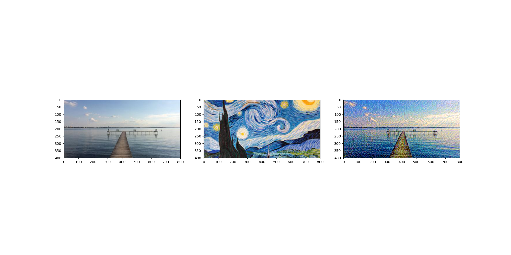
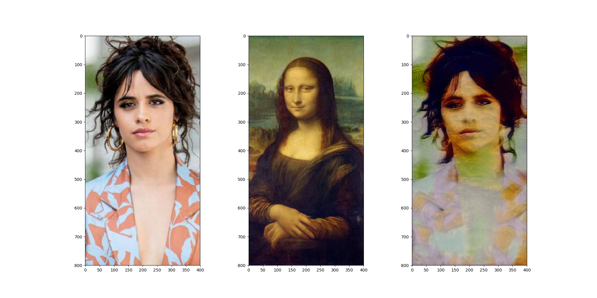
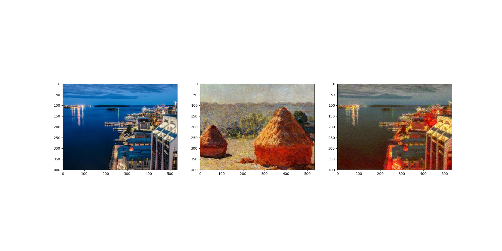
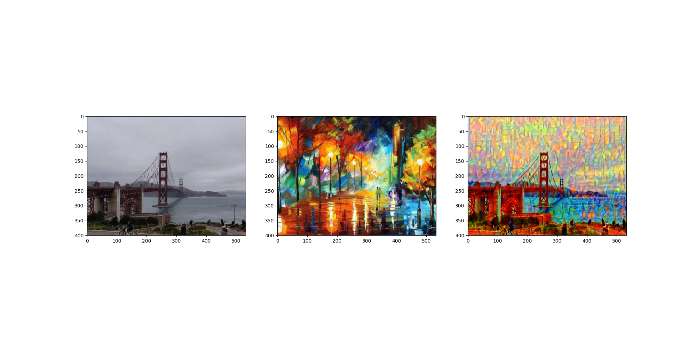

# Art Generator

## Intro
This is a demo for the style transfer using CNN. I will update this repo in this summer randomly. The full program will be based on shell script.  

## Experiment 0
Lake Mendota Deck + Starry Night

    

Good texture with similar coloring

## Experiment 1
Camila Cabello + Mona Lisa

    

Texture is very strange and coloring is also zigzagged.

## Experiment 2
Halifax + End of Summer

    

Completely change the original style from cold color to warm color. Consider a successful experiment.

## Experiment 3
Golden Gate Bridge + a random colorful painting

    

Nice color on the bridge but the sky is a little strange

## Next Step
Shell scripts to use this
